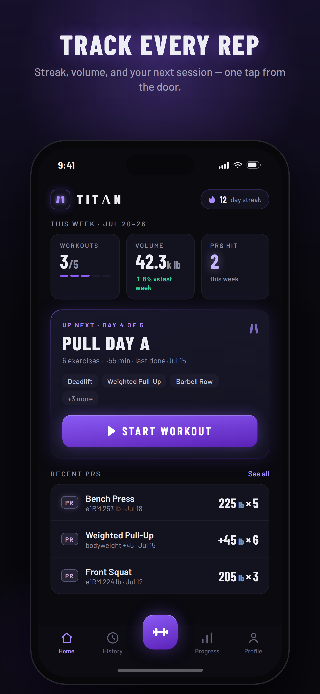
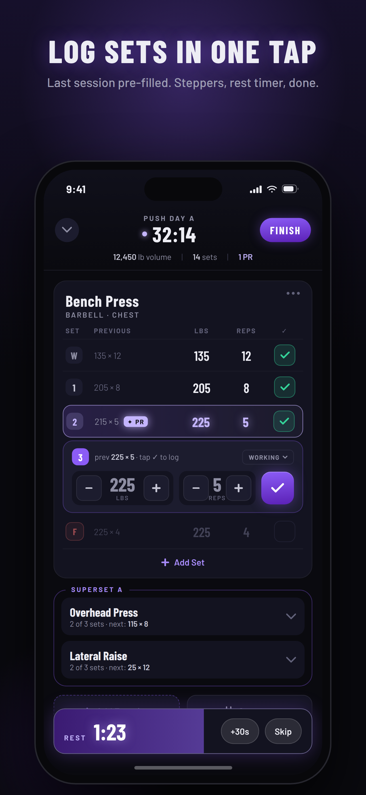
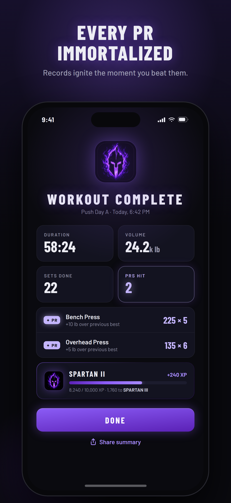
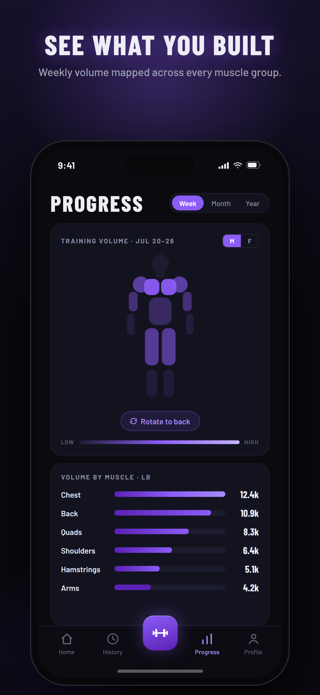
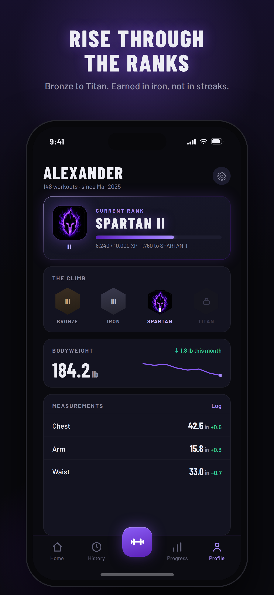

# TITΛN — Strength Logger

A native iOS strength-training tracker. Dark-only, purple-on-black, built to match the
Claude Design handoff (`DESIGN_BRIEF.md` has the full feature scope).

**Demo video:** [promo/renders/titan-promo.mp4](promo/renders/titan-promo.mp4) (26s, vertical) ·
VALKYRIE: [promo/renders/valkyrie-promo.mp4](promo/renders/valkyrie-promo.mp4)
**Status:** live on the App Store.

<p>
  
  
  
  
  
</p>

## The case study

> Portfolio project: the polished-product piece. Brief → Claude Design → native code →
> TestFlight in five days, and a second app for free on day three.

**Problem.** Most workout trackers are slow at the one moment that matters: between
sets, when you're gassed and want to record a number and get back under the bar. They
bury logging under accounts, sync, and social features, and they hide the two things
lifters actually care about (did I beat my best, and what have I actually trained this
week) behind menus. I wanted a log that gets out of the way, catches personal records
without spreadsheets, and stores everything on the phone with no account.

**What I built.** A native SwiftUI + SwiftData app for iOS 17+, about 7,500 lines of
Swift across 15 screens: one-tap set logging with last session's numbers pre-filled,
an automatic rest timer, estimated one-rep-max tracking with PR detection on every set,
routines with supersets and a program library, a front-and-back muscle heat map of
weekly volume, a twelve-level rank ladder, a plate calculator, and body and supplement
tracking. Fully offline. Then, on day three, a brand configuration layer that builds a
second app, **VALKYRIE**, from the same codebase: light palette, different wordmark,
rank names, copy, and default body model, switched by one compilation condition.

**How AI was used.** TITAN is not an AI product; the AI is in how it was made.
- **Design first, in Claude Design.** The brief in `DESIGN_BRIEF.md` was written before
  any code, with the palette pulled from the logo and every v1 feature scoped. Claude
  Design produced the screens; the handoff in `design/handoff` is the source the app was
  built to match, and the App Store screenshots were rendered from the same handoff so
  the listing matches the product.
- **Built with Claude Code.** From handoff to a compiling SwiftUI app in a day, then
  iterated from real use: a feedback round moved custom workouts first, replaced steppers
  with typed input where it mattered, and made set types clearer. The heat map went
  through three anatomy attempts in one afternoon and was reverted to the simpler
  pill-style body, because the realistic silhouette looked worse at phone size.
- **Promo in code.** The two 26-second promo videos are Remotion compositions that read
  the app's real palette, fonts, and icons, so one timeline renders both brands, the same
  way one codebase builds both apps.

**Decisions worth noting.**
- Started as a PWA and switched to native SwiftUI on day one, for haptics, background
  rest timers, and SwiftData persistence without a backend.
- No account and no network in v1. It shipped faster, and it makes the privacy story
  one sentence long.
- The brand layer was a deliberate bet: if every feature had to land in both apps
  automatically, a second brand would cost a day rather than a fork. It did.

**Result.** Brief on 22 July 2026, TestFlight builds by 25 July, App Store submission
package (metadata, privacy pages, screenshots in three device sizes) by 26 July, and
live on the App Store. Two apps, one codebase, 29 commits. The same brief-to-handoff-to-code pipeline was reused
for the next portfolio project, [Distill](https://github.com/LStar977/distill).

---

**This repo builds two apps from one codebase:**

| Target | Brand | Theme | Bundle ID |
|---|---|---|---|
| `Titan` | TITΛN — dark, mythic (Bronze → Titan ranks) | Dark purple/black | `com.lancemorrison.titan` |
| `Valkyrie` | VALKYRIE — bright, empowering (Ember → Immortal ranks) | Light blush/pink | `com.lancemorrison.valkyrie` |

All branding (palette, wordmark, copy, rank ladder, default body model, flagship
program) routes through `Titan/Brand.swift`, switched by the `VALKYRIE` compilation
condition on the Valkyrie target. Every feature lands in both apps automatically —
pick the scheme in Xcode to build either one.

 

## Features

- **Workout logging** — sets × reps × weight with ghost values pre-filled from your last
  session; one tap on ✓ repeats it. Set types: warm-up / working / failure / drop.
- **PR detection** — every completed set is checked against your all-time estimated 1RM
  (Epley); beating it ignites the violet-glow PR row + haptic.
- **Auto rest timer** — starts on set completion, docks at the bottom with +30s / Skip.
- **Routines** — 4 starter templates seeded (Push A/B, Pull A, Legs), full editor with
  reorder, per-exercise sets/rep-range/rest, and superset grouping.
- **Exercise library** — ~60 seeded exercises, searchable, filterable by muscle and
  equipment, plus custom exercises.
- **History** — month calendar with trained days, streaks, and per-day summaries.
- **Exercise detail** — e1RM trend, weekly volume bars, full session history.
- **Progress** — front/back muscle heat map + volume-by-muscle bars (week/month/year).
- **Titan Ranks** — XP from sets, PRs, and finished workouts climbs Bronze → Iron →
  Spartan → Titan (3 tiers each).
- **Plate calculator** — target weight → plates per side, with bar options.
- **Body metrics** — bodyweight sparkline + chest/arm/waist measurements.
- **Supplements** — one-tap serving logging (creatine, protein, custom), daily
  totals and a 7-day history. Quick-log card on Home, full page from Profile.

Everything is stored on-device with SwiftData. No account, no network.

## Running it

1. Open `Titan.xcodeproj` in **Xcode 16 or newer** on macOS.
2. Select the **Titan** scheme and an iPhone simulator (iOS 17+).
3. **⌘R**.

To run on a physical iPhone, set your development team under
*Target → Signing & Capabilities* first.

## Project layout

```
Titan/
├── TitanApp.swift          # entry point, SwiftData container, font registration
├── AppState.swift          # observable app state (active workout, rest timer, tab)
├── Theme.swift             # design tokens: colors, Barlow fonts, shared styles
├── Models/
│   ├── Models.swift        # SwiftData models (Exercise, Routine, Workout, Set…)
│   ├── Stats.swift         # e1RM, volume, streaks, PRs, Titan rank system
│   └── SeedData.swift      # exercise library + starter routines, workout builder
├── Views/                  # one file per screen + shared components
├── Fonts/                  # Barlow & Barlow Condensed (OFL licensed)
└── Assets.xcassets         # app icon, accent color
```

Fonts are registered at runtime (`CTFontManagerRegisterFontsForURL`), so no Info.plist
font keys are needed.
